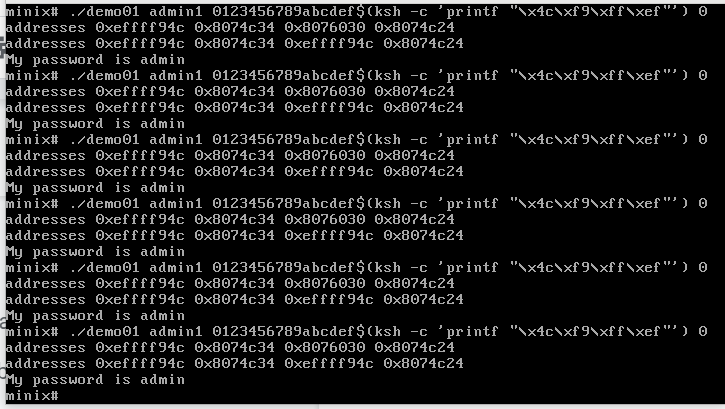
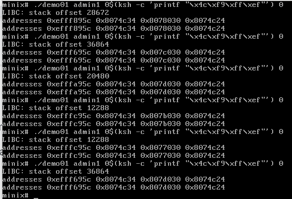
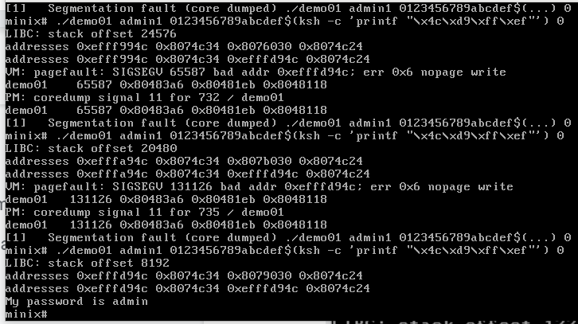

DD2497 System Security Rroject with Minix

Before implementing ASLR the stack (first of the 4 printed addresses) and the heap (third of the 4 printed addresses) is the same every time. This makes it easy to leak the password.

After implementing ASLR the addresses of the stack and the heap are randomized to a ceratin extent (like the solution from the lectures we went with 10 possible offsets).

However, since the entropy is low due to our low space of possible offsets you can quickly brute-force it still, so in practice one would have to have a much larger space of possible offsets.
 

## Participants

André Brogärd, brogard@kth.se  
Tommie Andersson tommiean@kth.se  
Henrik Kultala, kultala@kth.se  
Albin Winkelmann, albinwi@kth.se  
Hîvron Stenhav, hivron@kth.se
